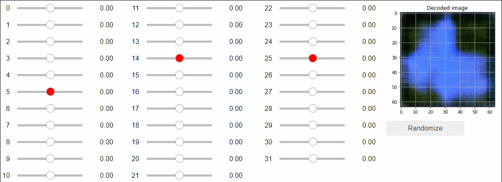
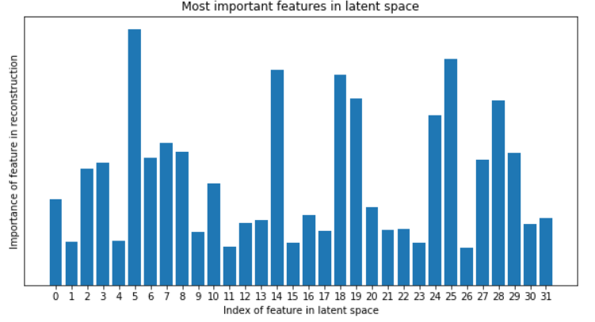
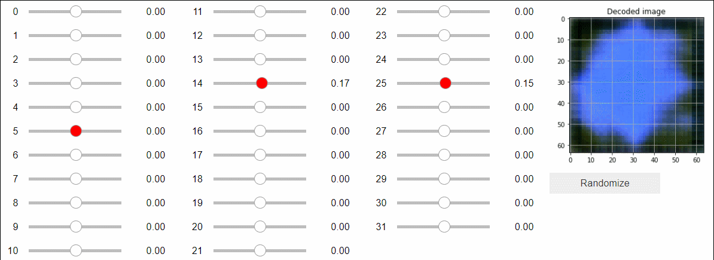

# Variational Autoencoder - VAE

In this repository you will find a *Variational Autoencoder* implementation which uses
*Convolutional* layers to encode the input images to a latent vector, and *Traansposed Convolutional* layers to
reconstruct the encoded vectors into images.

## Latent Space Playground

Check out the [notebook](latent_playground.ipynb) which contains the code for the experiments

### Feature Importance

We can measure that in the latent space which feature is the most important for the reconstruction.
By "most important" I mean the ones which contribute to the bigger changes on the decoded images.

### Interactive Image Reconstruction

In this part of the [notebook](latent_playground.ipynb), you can play with the latent space to generate your own
images based on the latent vector values.

